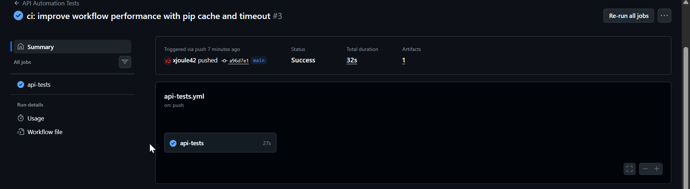
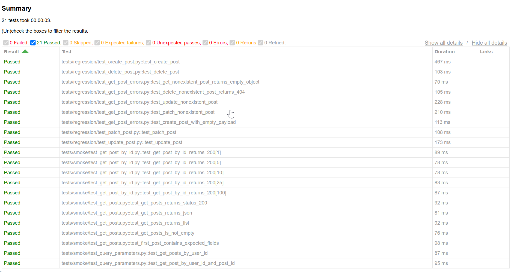

# 🚀 QA API Automation Framework

[](https://www.python.org/)
[](https://pytest.org/)
[](https://github.com/<TU_USUARIO>/<TU_REPOSITORIO>/actions)


A production-inspired API automation framework built with Python, Pytest, and Requests.

This project demonstrates reusable test architecture, API validation, HTML reporting, and Continuous Integration using GitHub Actions, following QA Automation best practices.

---

## 📸 Project Preview

### GitHub Actions



### HTML Report



---

## 🎯 What you'll find in this project

This repository demonstrates how to build an API automation framework from scratch using industry best practices, including:

- Clean architecture
- Reusable components
- Automated reporting
- Continuous Integration
- Maintainable test design

---

# 📖 Project Overview

This project showcases how to build a maintainable API automation framework from scratch using Python.

The framework focuses on:

- REST API testing
- Test organization
- Reusable architecture
- JSON Schema validation
- Logging
- HTML reporting
- Continuous Integration with GitHub Actions

The public API used for testing is:

> https://jsonplaceholder.typicode.com

---

# ✨ Highlights

- Modular framework architecture
- Reusable Base API Client
- JSON Schema validation
- HTML reporting with pytest-html
- CI/CD with GitHub Actions
- Environment-based configuration
- Reusable fixtures and assertions
- Clean and scalable project structure

---

# 🎯 Objectives

- Learn API automation using Python.
- Apply software testing best practices.
- Build reusable testing utilities.
- Validate API responses and schemas.
- Generate professional HTML reports.
- Execute automated tests in GitHub Actions.
- Create a portfolio-ready automation framework.

---

# 🛠 Technologies

| Technology | Purpose |
|------------|---------|
| Python 3.13 | Programming language |
| Pytest | Test framework |
| Requests | HTTP client |
| JSON Schema | Response validation |
| python-dotenv | Environment configuration |
| pytest-html | HTML reports |
| GitHub Actions | Continuous Integration |

---

# 📁 Project Structure

```text
qa-api-automation/
│
├── .github/
│   └── workflows/
│
├── config/
│
├── logs/
│
├── reports/
│
├── src/
│   ├── clients/
│   ├── helpers/
│   ├── models/
│   ├── utils/
│   └── validators/
│
│
├── tests/
│   ├── fixtures/
│   ├── integration/
│   ├── regression/
│   ├── schemas/
│   └── smoke/
│
├── requirements.txt
├── pytest.ini
└── README.md
```

---

# ⚙️ Installation

Clone the repository.

```bash
git clone https://github.com/xjoule42/qa-api-automation.git
```

Go to the project.

```bash
cd qa-api-automation
```

Create a virtual environment.

```bash
python -m venv .venv
```

Activate it.

Windows

```bash
.venv\Scripts\activate
```

Linux/macOS

```bash
source .venv/bin/activate
```

Install dependencies.

```bash
pip install -r requirements.txt
```

---

# 🔧 Environment Variables

Create a `.env` file.

```text
BASE_URL=https://jsonplaceholder.typicode.com
TIMEOUT=10
```

If no `.env` file exists, default values are automatically used.

---

# ▶️ Running the Tests

Execute all tests.

```bash
pytest
```

Execute a specific suite.

```bash
pytest tests/smoke
```

Execute one test.

```bash
pytest tests/regression/test_create_post.py
```

---

# 📊 HTML Reports

Every execution automatically generates an HTML report.

```text
reports/report.html
```

Open the file in your browser to inspect:

- Test results
- Execution time
- Passed/Failed tests
- Detailed execution summary

---

# ✅ Continuous Integration

The project uses **GitHub Actions**.

On every:

- Push
- Pull Request

GitHub automatically:

- Installs dependencies
- Executes all tests
- Generates an HTML report
- Uploads the report as an Artifact

---

# ✔ Features

- ✅ Base API Client
- ✅ CRUD API Testing
- ✅ Reusable Fixtures
- ✅ Reusable Assertions
- ✅ JSON Schema Validation
- ✅ Response Validation
- ✅ Logging
- ✅ Environment Configuration
- ✅ HTML Reports
- ✅ GitHub Actions CI

---

# 🧪 Test Coverage

The framework currently includes automated tests for:

- GET requests
- POST requests
- PUT requests
- PATCH requests
- DELETE requests
- Query parameters
- Status code validation
- Response body validation
- JSON Schema validation
- Negative scenarios

---

# 🚀 Future Improvements

- API Authentication (OAuth2 / JWT)
- Allure Reports
- Parallel execution with pytest-xdist
- Docker support
- Test data factories
- API mocking
- Performance testing
- Code coverage
- Pre-commit hooks

---

# 👨‍💻 Author

**Julio Soto**

Senior QA Engineer | QA Automation | Python | API Testing

GitHub:
https://github.com/xjoule42

LinkedIn:
https://linkedin.com/in/TU-PERFIL

---

⭐ If you found this project useful, consider giving it a star.